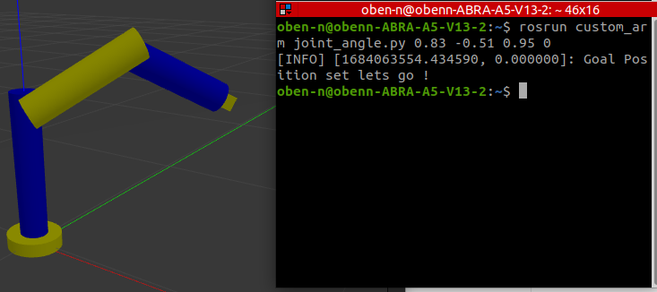

# Resources
- **[Udemy Course: ROS-Ultimate-guide-for-Custom-Robotic-Arms-and-Panda-7-DOF](https://www.udemy.com/course/robotics-with-ros-build-robotic-arm-in-gazebo-and-moveit/)**

- **[Course Repository](https://github.com/noshluk2/ROS-Ultimate-guide-for-Custom-Robotic-Arms-and-Panda-7-DOF-)**

- **[Panda URDF](https://github.com/HarshBhatt09/Franka-Emika-Panda-7-DOF-Robot-ROS-Noetic)**

# Installations
```bash
sudo apt-get install ros-noetic-joint-trajectory-controller
sudo apt-get install ros-noetic-effort-controllers
sudo apt-get install ros-noetic-position-controllers
```

# Package: custom_arm

## To control joints in open-loop with joint_state_publisher_gui in RViZ 
```bash
roslaunch custom_arm rviz.launch
```

## To launch robot in Gazebo and send joint trajectory to robot using terminal
```bash
roslaunch custom_arm gazebo_controller.launch
rosrun custom_arm joint_angle.py <joint_1> <joint_2> <joint_3> <joint_4>
```
<p align="center">
  
  <br> Code Execution
</p>

<p align="center">
  
  <br> Node-Topic Graph
</p>

Topic: custom_arm_controller/command  
Type: trajectory_msgs/JointTrajectory

```bash
header: 
  seq: 1
  stamp: 
    secs: 0
    nsecs:         0
  frame_id: ''
joint_names: 
  - joint_1
  - joint_2
  - joint_3
  - joint_4
points: 
  - 
    positions: [0.83, -0.51, 0.95, 0]
    velocities: [0.0, 0.0, 0.0, 0.0]
    accelerations: [0.0, 0.0, 0.0, 0.0]
    effort: []
    time_from_start: 
      secs: 3
      nsecs:         0
```

# Package: panda_franka

## To control joints in open-loop with joint_state_publisher_gui in RViZ 
```bash
roslaunch panda_franka rviz.launch
```

<p align="center">
  
  <br> RViZ - Joint State Puplisher GUI
</p>

<p align="center">
  
  <br> Node-Topic Graph
</p>

Topic: /joint_states
Type: sensor_msgs/JointState
```bash
header: 
  seq: 6961
  stamp: 
    secs: 1684978004
    nsecs: 704809665
  frame_id: ''
name: 
  - panda_joint1
  - panda_joint2
  - panda_joint3
  - panda_joint4
  - panda_joint5
  - panda_joint6
  - panda_joint7
position: [-0.6403032999999998, 0.3712456799999999, -0.2132412800000001, -2.1155627800000003, -0.7927012799999997, 2.899349, -0.6101713800000002]
velocity: []
effort: []
```

## To launch robot in Gazebo and send joint trajectory to robot using terminal
```bash
roslaunch panda_franka gazebo_controller.launch
rosrun panda_franka joint_angle.py <joint_1> <joint_2> <joint_3> <joint_4> <joint_5> <joint_6> <joint_7>
```
<p align="center">
  
  <br> Code Execution
</p>

<p align="center">
  
  <br> Node-Topic Graph
</p>

## To launch robot in Gazebo and send end-effector positions to robot using terminal
```bash
roslaunch panda_franka gazebo_controller.launch
rosrun panda_franka panda_goal_point.py <end_effector_x> <end_effector_y> <end_effector_z>
```
